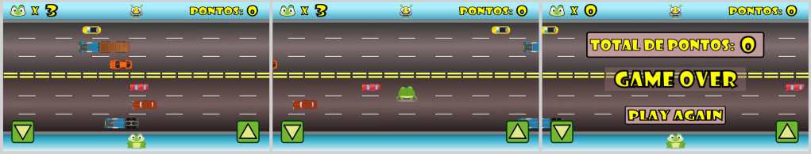

# Jogo Sapo

O jogo consiste em ajudar um sapo a atravessar uma rua cheia de carros passando em velocidades diferentes. O objetivo é alcançar um besouro do outro lado da rua para se alimentar. Toda vez que se chega ao besouro, a pontuação aumenta. Caso um carro atinja o sapo, ele perde uma vida.

## Como surgiu

Durante um curso de extensão sobre jogos no IFCE Campus Jaguaruana, surgiu a ideia de fazer uma versão do jogo ensinado com sprites melhorados e com versão para mobile.

## Screenshots

## Plataformas

Web e Android

## Controles

Mouse e Touch:

- Clique do mouse ou touch nos botões com setas movem o sapo para cima ou para baixo

## Download

O jogo pode ser jogado baixado no link: https://henriqueneto.itch.io/sapo

## Contatos

- Perfil itch.io: https://henriqueneto.itch.io
- Email: henrique.neto.dev@gmail.com
- Instagram: https://www.instagram.com/arte.henrique.neto
